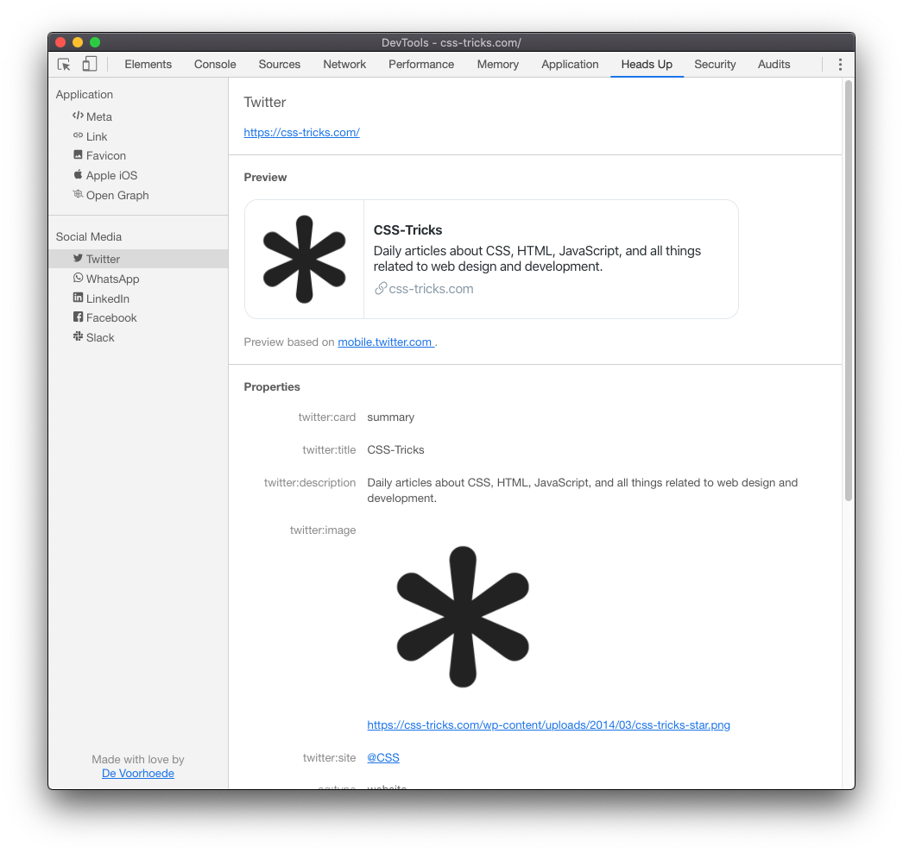
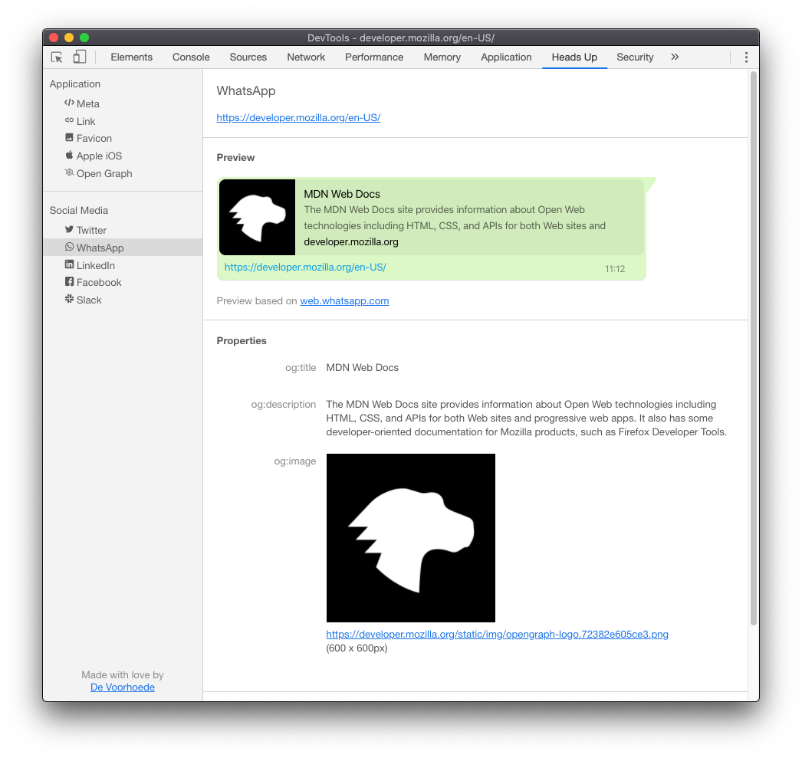
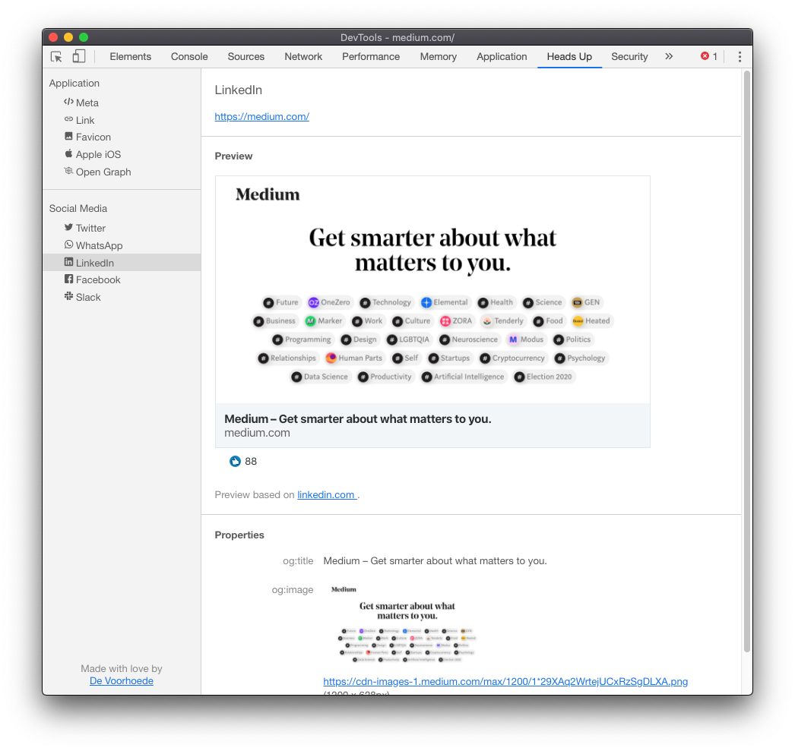
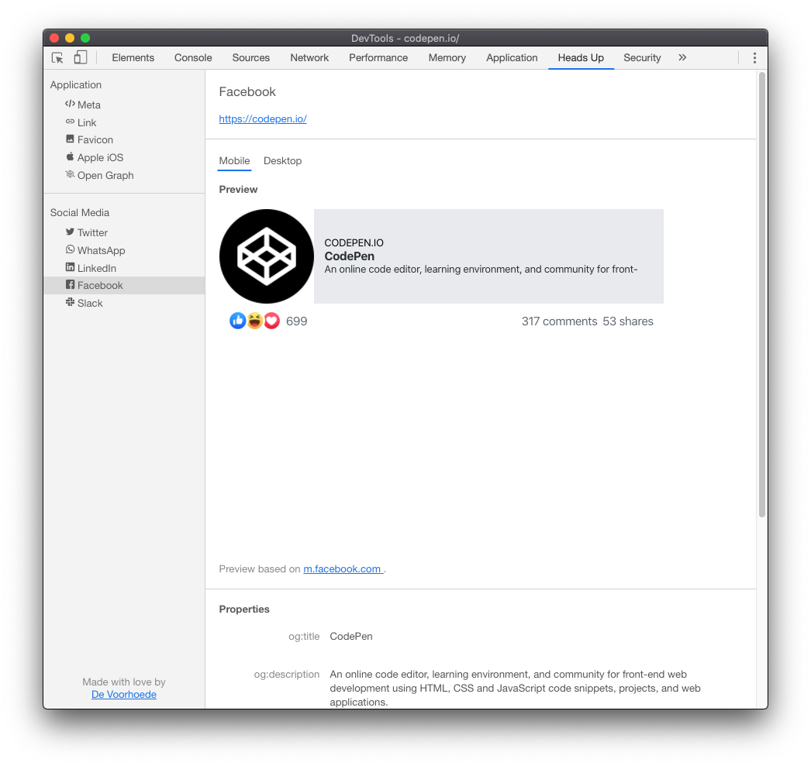
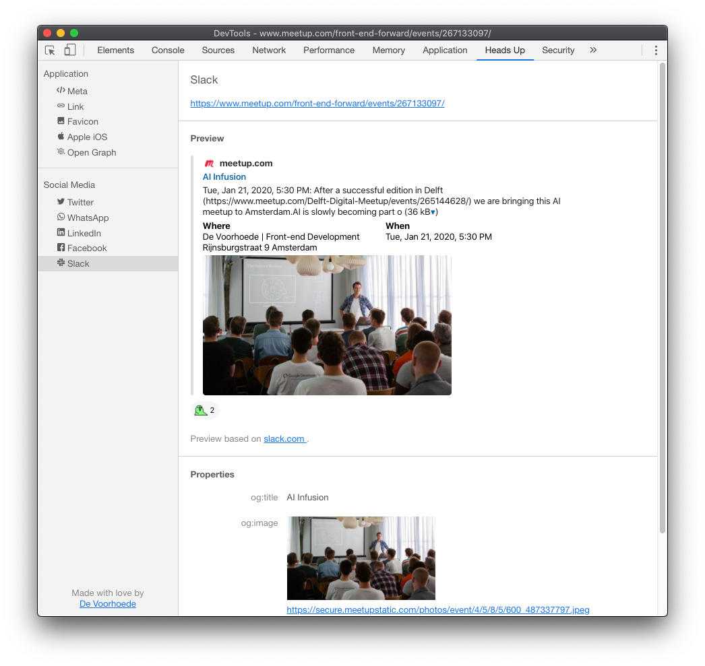
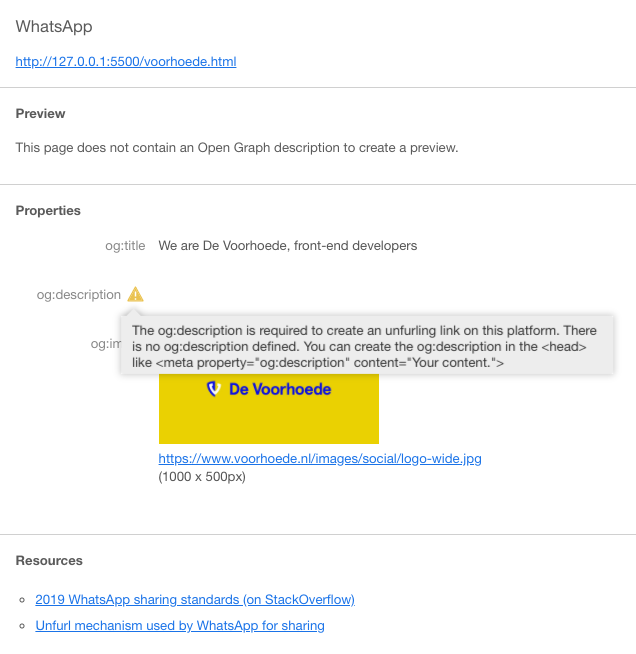
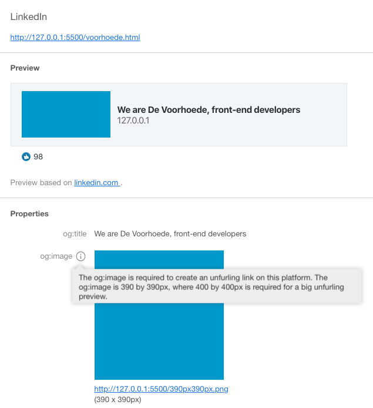
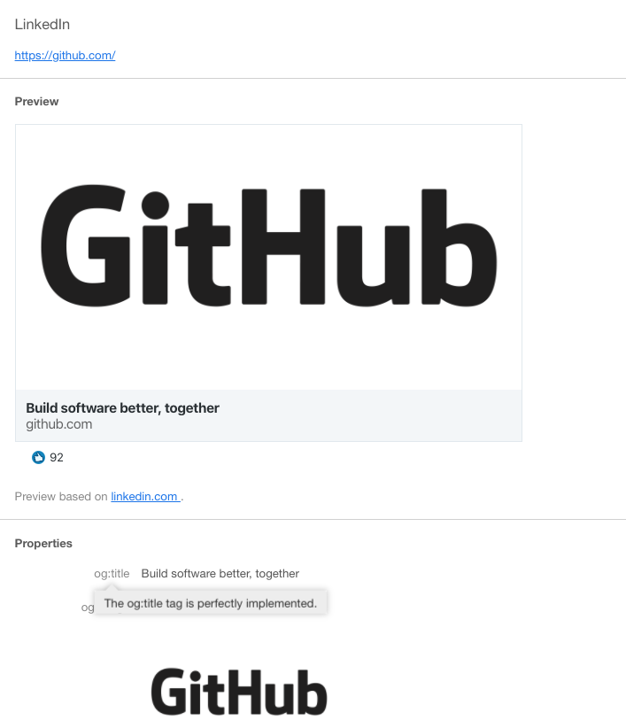

# Heads Up Browser Extension

**Visualise everything in your `<head>` with the Heads Up Devtools**

[Install Heads Up from Web Chrome Store](https://chrome.google.com/webstore/detail/heads-up/ajjdmakdoicbgmgoacfmlplnefljpcke)

## Features

* Presents key page meta (title, charset, viewport, ...) and favicons.
* Presents all link relations (`rel=""`) and values (name, href, type, ...).
* Presents all favicon images with sizes and type names (x-icon, png).
* Presents Apple iOS (`apple-mobile-web-*`) settings, touch icons and startup images.
* Presents all Open Graph (`og:*`) properties found in the page.
* Presents Twitter settings (`twitter:*`) and a preview of a Twitter card.
* Presents WhatsApp settings (`og:*`) and a preview of a WhatsApp unfurled link.
* Presents LinkedIn settings (`og:*`) and a preview of a LinkedIn unfurled link.
* Presents Facebook settings (`og:*`) and a preview of a Facebook mobile and desktop unfurled link.
* Presents Slack settings (`og:*`) and a preview of a Slack unfurled link.
* Works with any site and web app (incl. localhost).
* Supports editing in devtools and hot module reloading.
* Gives feedback to improve your code with tooltips.

## Video

[](https://www.youtube.com/watch?v=HboZ0MGvuCQ)

## Social media

<details open>
<summary>Twitter Card preview</summary>


</details>

<details>
<summary>WhatsApp Card preview</summary>


</details>

<details>
<summary>LinkedIn Card preview</summary>


</details>

<details>
<summary>Facebook Card preview</summary>


</details>

<details>
<summary>Slack Card preview</summary>


</details>

## Live feedback

Heads Up provides their users with live feedback. The feedback will be shown after hovering over icons and titles. The feedback will give you a description of the item, feedback to improve or an error with a solution.

<details open>
<summary>Error message</summary>


</details>

<details>
<summary>Warning message</summary>


</details>

<details>
<summary>success message</summary>


</details>

## Development

Heads Up is a [Chrome Devtools extension](https://developer.chrome.com/extensions/devtools).

### Setup

The source code lives in two directories:

```
wrapper/          <- Wraps vue-app as a devtool
  manifest.json   <- Devtools extension entry file
  devtools/       <- Devtools specific files
    assets/
    background.js
    content.js
    devtools.html
    devtools.js
vue-app/          <- Heads Up app, built with Vue 3
  public/
  src/
    components/
    lib/
    router/
    store/
    style/
    views/
    main.js

../@shared/       <- Resources shared with other apps
    assets/
    components/
    lib/
```

This browser-extension shares files with the landing page and the web-app. These files are imported from an adjacent project directory `../@stared/`.

The `manifest.json` registers our extension and bootstraps our Devtools (`src/devtools/devtools.(html|js)`), which in turn creates a Devtools panel with Heads Up (`src/heads-up/index.(html|js)`), which starts our Heads Up app (`src/heads-up/App.vue`).

The Heads Up app receives its data from the Devtools via messages (in `src/heads-up/index.js`). Devtools injects a content script (`src/devools/content.js`) into the scope of the web page. That content script is responsible for extracting the data we need in our app. Because our Heads Up app and our content script can't communicate directly, a background script (`src/devtools/background.js`) proxies our messages between the two.

### Workflow

The development workflow is a bit different from regular web apps:

* Clone the [repository](https://github.com/voorhoede/heads-up)
* Install dependencies: `npm install` from the root of the repository.
* Start development
  * from root directory: `npm run dev:web-app`
  * from this directory: `npm run start`
* Open Chrome and go to [`chrome://extensions/`](chrome://extensions/)
* Enable __Developer mode__
* Hit __Load unpacked__ and select the `dist/` directory of the project folder
* Visit any web page, open the Devtools and find the Heads Up panel
* If you make changes to anything in `src/devtools/` you need to reload the extension via [`chrome://extensions/`](chrome://extensions/)
* If you make changes to `src/heads-up/` you only need to hit the __refresh__ button in the top-right corner of the Heads Up panel.

### Scripts

This project requires [Node.js](http://nodejs.org/) (>= v10) and [npm](https://npmjs.org/) (comes with Node).

After installing dependencies using `npm install` the following scripts are available:

`npm run ...` | Description
---|---
`build` | Builds devtools package to `dist/`.
`dev` | Runs `dev:wrapper` and `dev:vue-app` in parallel.
`dev:wrapper` | Compiles the devtools wrapping code
`dev:vue-app` | Compiles Vue app to `dist/` on file changes.
`lint` | Checks code for code style violations.
`lint:fix` | Checks code for code style violations and fixes them when possible.

## License

[MIT Licensed](license) by [De Voorhoede](https://www.voorhoede.nl)
